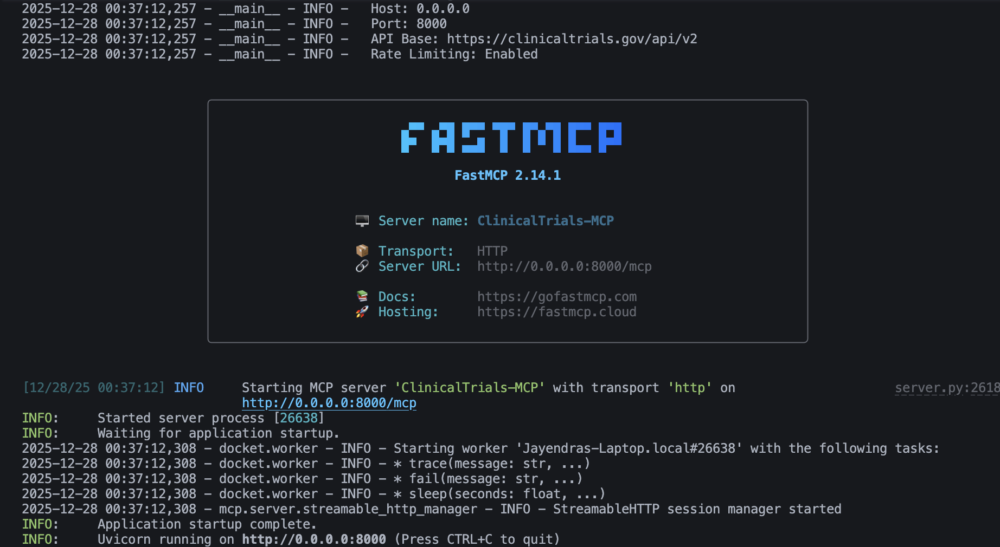
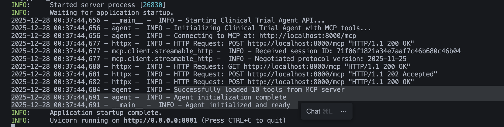

# TrialTalk - Agentic Clinical Trial Intelligence System

### 🎥 Live Demo


https://github.com/user-attachments/assets/ee53bdbd-e582-43eb-9ebe-254aa178ebd9


A modular **Agentic AI System** designed to revolutionize how researchers and patients access clinical trial data. Powered by **Model Context Protocol (MCP)**, **LangGraph**, and **Google Gemini 2.5**, TrialTalk autonomously navigates the vast registry of [ClinicalTrials.gov](https://clinicaltrials.gov/) to provide evidence-based insights, comparative analysis, and real-time eligibility assessments.

> **"Built with ❤️ by Suyash Ekhande"**

---

## 🚀 Key Highlights

*   **Agentic Architecture**: Implements a **ReAct** (Reasoning + Acting) loop where the AI autonomously decides which tools to use, filters data, and synthesizes answers.
*   **Model Context Protocol (MCP)**: Utilizes the emerging MCP standard to decouple the LLM from the data tools, creating a scalable and interchangeable tool ecosystem.
*   **Production-Ready Tech Stack**: Built with **Next.js 15**, **FastAPI**, **FastMCP**, **LangGraph**, **LangChain**, **Gemini 2.5 Flash**, **Shadcn UI**.


---

## 🏗️ System Architecture

Trialtalk is composed of three decoupled microservices working in harmony:

### 1. **ClinicalTrials MCP Server** (Python/FastMCP)
*   **Role**: The "Hands" of the system.
*   **Tech**: FastMCP, Pydantic, HTTPX.
*   **Function**: Exposes 8+ granular tools to interact with the ClinicalTrials.gov API v2. It handles rate limiting, error retries, and data validation.
*   **Key Tools**: `search_clinical_trials`, `get_study_details`, `get_statistics`.


### 2. **ClinicalTrial Agent** (Python/LangGraph)
*   **Role**: The "Brain" of the system.
*   **Tech**: LangChain, LangGraph, Gemini 2.5 Flash, FastAPI.
*   **Function**:
    *   Maintains conversation memory and state.
    *   Executes the ReAct loop to solve complex multi-step queries.
    *   Streams thoughts and final answers via Server-Sent Events (SSE).


### 3. **ClinicalTrial UI** (Next.js/React)
*   **Role**: The "Face" of the system.
*   **Tech**: Next.js 15, TypeScript, TailwindCSS, Shadcn UI, Framer Motion.
*   **Function**:
    *   Modern, responsive chat interface.
    *   Renders Markdown and structured data tables.
    

---

## 🛠️ Tech Stack & Tools

*   **AI & LLM**: Google Gemini 2.5 Flash, LangChain, LangGraph.
*   **Protocol**: Model Context Protocol (MCP), **FastMCP**.
*   **Backend**: Python 3.12, FastAPI, Uvicorn.
*   **Frontend**: Next.js (App Router), React 19, Lucide Icons.
*   **Styling**: Tailwind CSS, Shadcn UI.
*   **Data Source**: ClinicalTrials.gov API v2.

---

## ⚡ Quick Start

### Prerequisites
*   Node.js 20+
*   Python 3.12+
*   Gemini API Key (Google AI Studio)

### 1. Clone the Repository
```bash
git clone https://github.com/yourusername/Trialtalk-Agentic-Clinical-Trial-Insights.git
cd Trialtalk-Agentic-Clinical-Trial-Insights
```

### 2. Setup MCP Server (Port 8000)
The MCP server handles the connection to ClinicalTrials.gov.
```bash
cd clinicaltrials-mcp
python3 -m venv venv
source venv/bin/activate
pip install -r requirements.txt
cp .env.example .env  # No API keys needed for this part
python server.py
```

### 3. Setup Agent Service (Port 8001)
The Agent connects to the MCP server and coordinates the logic.
```bash
cd ../clinicaltrial-agent
python3 -m venv venv
source venv/bin/activate
pip install -r requirements.txt
cp .env.example .env
# ⚠️ Add your GEMINI_API_KEY to .env
python api/main.py
```

### 4. Setup Frontend UI (Port 3000)
The Next.js application.
```bash
cd ../clinicaltrials-ui
npm install
npm run dev
```

Visit **http://localhost:3000** to interact with the agent!

---

## 💡 Usage Scenarios

### 🔬 Feasibility Research
> *"Find Phase 3 lung cancer trials in New York recruiting patients with EGFR mutations."*
The agent will filter by phase, condition, location, and recruitment status.

### 📊 Comparative Analysis
> *"Compare the enrollment size of the top 3 diabetes studies starting after 2023."*
The agent fetches multiple studies and synthesizes a comparison.
---
